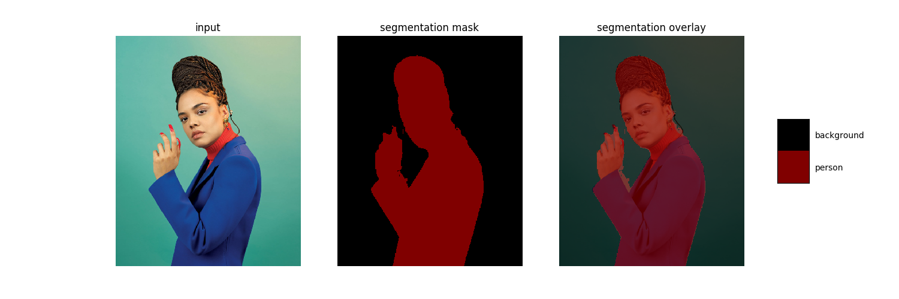

# Mobile Deeplab-V3+ model for Segmentation
This project is used for deploying people segmentation model to mobile device
 and learning. The people segmentation android project is [here](#). The model is another [Encoder-Decoder with Atrous Separable Convolution for Semantic Image Segmentation (Deeplab-V3+)](https://arxiv.org/pdf/1802.02611) implementation base on 
[MobilenetV2](https://arxiv.org/pdf/1801.04381.pdf) / [MobilenetV3](https://arxiv.org/pdf/1905.02244.pdf) on TensorFlow.

This project uses `tf.estimator` API to do training, and many code come from [TensorFlow model](https://github.com/tensorflow/models/tree/master/research/deeplab), 



## Dataset
This project supports 2 dataset.
1. [PASCAL VOC2012](http://host.robots.ox.ac.uk/pascal/VOC/)
    * Base dataset used for test.
    * You could download the [augmented segmentation dataset](https://github.com/DrSleep/tensorflow-deeplab-resnet) from DrSleep.
2. [Supervisely People dataset](https://hackernoon.com/releasing-supervisely-person-dataset-for-teaching-machines-to-segment-humans-1f1fc1f28469).
    * People Segmentation dataset.
    * More data could refer to the [blog]()
    * Download from [Google Drive](https://drive.google.com/open?id=1Txza4tKEH0TDoTfv7HG_bPQxDMaX0pii), [baidu pan](https://pan.baidu.com/s/19okXk4fZgzFk-Qsqm-uuOQ), code: `8pdv`

## Environment
* TensorFlow v1.12.0
    1. No module named keras_applications: [solution](https://github.com/tensorflow/tensorflow/issues/21518)
    2. AttributeError: 'Estimator' object has no attribute '_distribution':
     [solution](https://github.com/tensorflow/tensorflow/issues/23508).

## Usage
0. Prepare pretrained MobilenetV2 model(optional)
    ```bash
    bash prepare.sh
    ```
1. Train
    * train on pascal voc 2012 dataset
    ```bash
    bash train_pascal_voc2012.sh
    # Tensorboard
    tensorboard --logdir=datasets/pascal_voc2012/exp/deeplab-v3-plus/train
    ```
    * train on people segmentation dataset 
    ```bash
    mv people_segmentation.tar.gz datasets
    bash train_people_seg.sh
    # Tensorboard
    tensorboard --logdir=datasets/people_segmentation/exp/deeplab-v3-plus/train
    ```
2. Export and Freeze model
    * pascal voc 2012 dataset
    ```bash
    bash export_pascal_voc2012.sh
    # Output
    # 1. TensorFlow Serving: datasets/pascal_voc2012/exp/deeplab-v3-plus/export/
    # 2. Frozen model: datasets/pascal_voc2012/exp/deeplab-v3-plus/export/frozen_model.pb
    ```
    * people segmentation dataset 
    ```bash
    bash export_people_seg.sh
    # Output
    # 1. TensorFlow Serving: datasets/people_segmentation/exp/deeplab-v3-plus/export/
    # 2. Frozen model: datasets/people_segmentation/exp/deeplab-v3-plus/export/frozen_model.pb
    ```
## Explanation
You could modify the parameters and add new backbones network easily.
1. Use `MobilenetV3` backbone: Change parameter from `--backbone="MobielentV2"` to `--backbone="MobilenetV3"` 
2. `quant_friendly`: Remove `BN` layer after `Depthwise Convolution`, replace `relu6` with `relu`, 
method from [A Quantization-Friendly Separable Convolution for MobileNets](https://arxiv.org/pdf/1803.08607).

## Result
1. Pascal VOC2012

| Backbone| Pretrained backbone | Augmented | Input Size| ASPP| Decoder | mIOU(%) |
| --- | --- | --- | --- | --- | --- | --- |
| MobilenetV2 | YES | YES | 513x513 | NO | NO| 70.51|

* Environment: base_lr=0.007, training_steps=30000, learning_policy=poly, num_gpu=1.

2. People Segmentation Dataset

| Backbone| Input Size| Augmented | ASPP| Decoder | Quant-Friendly | Steps | mIOU(%) | Pretrained Model |
| --- | --- | --- | --- | --- | --- | --- | --- | --- |
| MobilenetV2 | 256x256 | YES | NO | YES | YES | 150000| 81.68| [model](https://drive.google.com/open?id=11S7rKo7wmja3OBAbZnupNlWPyobyqsgg)|
| MobilenetV2 | 256x256 | YES | YES | YES | YES | 150000|83.33| [model](https://drive.google.com/open?id=1VF5yMz_tIkTOVfgmIgg7tPAJJEEcZ49B)|
| MobilenetV3 | 256x256 | YES | No | YES | YES | 150000|81.86| [model](https://drive.google.com/open?id=1ikeLDlIisBnF3ctPC0do_cABEw9EMJ7E)|
| MobilenetV2 | 513x513 | YES | No | YES | YES | 150000|89.55| [model](https://drive.google.com/file/d/1w_CjLGuIZ-Xdiuvmjd6FOV6LhRaMX2nR/view?usp=sharing)|

* Environment: base_lr=0.05, training_steps=150000, learning_policy=poly, num_gpu=1.
* `Augmented`: use augmented dataset.
## TODO
- [ ] Add LR-ASPP module in [MobilenetV3](https://arxiv.org/pdf/1905.02244.pdf).

## References
1. https://github.com/tensorflow/models/tree/master/research/deeplab
2. https://github.com/rishizek/tensorflow-deeplab-v3-plus
3. https://github.com/kuan-wang/pytorch-mobilenet-v3/blob/master/mobilenetv3.py
4. https://github.com/DrSleep/tensorflow-deeplab-resnet
